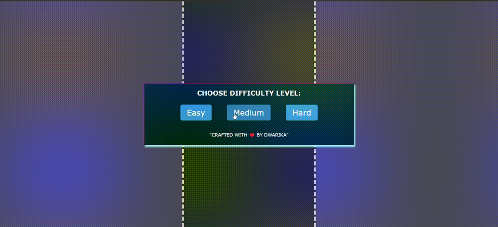

# Car Race Game

Welcome to the Car Race Game! This simple browser-based game allows players to control a car, avoid obstacles, collect coins, and achieve high scores. The game features different difficulty levels and includes interactive elements for an engaging experience. You can also play this on mobile web browser.

## Table of Contents

- [Demo](#demo)
- [Live Link](#live-link) 
- [Features](#features)
- [Getting Started](#getting-started)
- [How to Play](#how-to-play)
- [Game Controls](#game-controls)
- [Difficulty Levels](#difficulty-levels)
- [Scoring](#scoring)
- [Sound Effects](#sound-effects)
- [High Score](#high-score)
- [Pause and Resume](#pause-and-resume)
- [Home Button](#home-button)
- [Customization](#customization)
- [Contributing](#contributing)
- [License](#license)

## Demo



## Live Link

Check out the live link [here](https://speedmycar.netlify.app/).

## Features

- Responsive and visually appealing design.
- Three difficulty levels: Easy, Medium, and Hard.
- Dynamic gameplay with moving obstacles and collectible coins.
- Real-time scoring and high score tracking.
- Pause and resume functionality.
- Home button for easy navigation.
- Background music and sound effects.

## Getting Started

1. Clone the repository:

```bash
https://github.com/Dwarika202249/carrace.git
```

## How to Play
The objective of the game is to control the car, avoid collisions with enemy cars, and collect coins to achieve the highest score possible. Choose your preferred difficulty level to start the game.

## Game Controls
- Arrow Up: Move the car upward.
- Arrow Down: Move the car downward.
- Arrow Left: Move the car to the left.
- Arrow Right: Move the car to the right.
- Difficulty Levels

### The game offers three difficulty levels:

- Easy: Slower enemy cars and fewer obstacles.
- Medium: Moderate speed and obstacle density.
- Hard: Faster enemy cars and increased obstacles.

## Scoring
Players earn points based on the distance traveled.

## Sound Effects
The game features background music and sound effects for actions such as collecting coins and collisions.

## High Score
The player's high score is tracked and displayed. Beat your own high score or challenge your friends!

## Pause and Resume
Pause the game at any time by clicking the "Pause" button. Click "Resume" to continue the game.

## Home Button
Click the "Home" button to return to the main screen and choose a different difficulty level.

## Customization
Feel free to customize the game by modifying the code, adding new features, or changing visuals. Make it your own!

## Contributing
If you have ideas for improvements or find any issues, please contribute! Fork the repository and create a pull request with your changes.

## License
This project is licensed under the MIT License.
